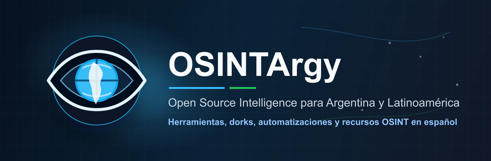

<p align="center">
  
</p>

<p align="center">
  <a href="https://github.com/IAZARA/OSINTArgy_v01/issues">Reportar un issue</a>
  ·
  <a href="#contribuir">Contribuir</a>
</p>

<p align="center">
  
  
  
  
</p>

<p align="center">
  <strong>Etiquetas:</strong>
  <code>osint</code>
  <code>argentina</code>
  <code>latam</code>
  <code>open-source-intelligence</code>
  <code>react</code>
  <code>nodejs</code>
</p>

# OSINTArgy

OSINTArgy es una plataforma open source para investigaciones OSINT éticas, con foco en Argentina y Latinoamérica. Reúne herramientas, dorks, recursos categorizados y módulos de automatización en una interfaz visual pensada para analistas, periodistas, investigadores, equipos de seguridad y personas que necesitan trabajar con fuentes abiertas de forma ordenada.

La descripción corta del proyecto es: **Plataforma OSINT open source para investigaciones éticas en Argentina y Latinoamérica.**

## Características

- Catálogo curado de herramientas OSINT con categorías, tags, dificultad, región e indicadores de uso.
- Interfaz visual tipo galaxia, vistas alternativas y navegación por categorías.
- Generador de dorks para Google, Yandex, Bing y DuckDuckGo.
- Búsqueda de usernames en múltiples plataformas.
- Módulos para OSINT de emails, análisis de archivos y reconocimiento de infraestructura.
- API REST con Express, MongoDB, autenticación JWT, rate limiting, CORS y logging estructurado.
- Frontend React + Vite con rutas SPA, servicios API y componentes modulares.

## Uso Responsable

OSINTArgy está pensado para investigación sobre fuentes públicas, auditoría defensiva, aprendizaje y documentación. Usalo solo con autorización, respetando leyes aplicables, términos de servicio y privacidad de terceros. El proyecto no promueve intrusión, abuso, acoso, doxxing ni acceso no autorizado.

## Stack

| Capa | Tecnología |
| --- | --- |
| Frontend | React 18, Vite, React Router, D3, Framer Motion, Lucide React |
| Backend | Node.js, Express, Mongoose, JWT, Helmet, Winston |
| Base de datos | MongoDB |
| DevOps | Docker Compose, Nginx, npm scripts |

## Requisitos

- Node.js 18 o superior.
- npm 9 o superior.
- MongoDB 5 o superior para desarrollo local.
- Docker y Docker Compose si preferís levantar el entorno containerizado.

## Instalación Local

```bash
git clone https://github.com/IAZARA/OSINTArgy_v01.git
cd OSINTArgy_v01
npm run install:all
```

Configurá variables de entorno desde los ejemplos:

```bash
cp backend/.env.example backend/.env
cp frontend/.env.example frontend/.env
```

Levantá frontend y backend con el script local:

```bash
npm start
```

URLs por defecto:

| Servicio | URL |
| --- | --- |
| Frontend | http://localhost:5173 |
| Backend API | http://localhost:3001/api |
| Health check | http://localhost:3001/api/health |

También podés correr cada servicio por separado:

```bash
cd backend
npm run dev
```

```bash
cd frontend
npm run dev
```

## Docker

Entorno de desarrollo:

```bash
docker compose up --build
```

Entorno de producción:

```bash
cp .env.production.example .env.production
docker compose --env-file .env.production -f docker-compose.prod.yml up -d --build
```

En producción, reemplazá `MONGO_PASSWORD` y `JWT_SECRET` por valores fuertes antes de levantar los servicios.
También configurá `FRONTEND_URL` con el origen real autorizado para CORS.

## Scripts

| Comando | Descripción |
| --- | --- |
| `npm start` | Inicia frontend y backend con gestión local de puertos. |
| `npm run dev` | Inicia frontend y backend en paralelo. |
| `npm run build` | Genera el build del frontend. |
| `npm run install:all` | Instala dependencias de raíz, frontend y backend. |
| `npm run test` | Ejecuta las suites de frontend y backend. |
| `npm run clean` | Detiene procesos locales de Vite, Nodemon y Node asociados al proyecto. |

## Estructura

```text
OSINTArgy/
├── backend/                 # API Express, modelos, rutas, controladores y scripts de datos
├── frontend/                # Aplicación React + Vite
├── docs/assets/             # Branding y recursos visuales del repositorio
├── scripts/                 # Scripts auxiliares versionados
├── docker-compose.yml       # Entorno Docker de desarrollo
├── docker-compose.prod.yml  # Entorno Docker de producción
└── README.md
```

No se versionan builds, logs, bases locales, `.env`, carpetas MCP ni configuraciones personales. Esos artefactos están cubiertos por `.gitignore` para mantener el historial limpio y reproducible.

## Módulos Principales

| Módulo | Descripción |
| --- | --- |
| Galaxy View | Exploración visual de categorías y herramientas OSINT. |
| Dork Generator | Plantillas y generación de búsquedas avanzadas. |
| Email OSINT | Validación y enriquecimiento inicial de correos. |
| Username OSINT | Búsqueda de presencia de usuarios en plataformas públicas. |
| File Analysis | Extracción de metadatos y análisis de archivos. |
| Infrastructure Scanner | Reconocimiento defensivo de dominios, IPs y servicios. |
| OSINT Academy | Material educativo, lecciones, audio y simuladores. |

## API

Endpoints principales:

```text
GET    /api/health
GET    /api/tools
GET    /api/tools/:id
GET    /api/tools/search
POST   /api/tools/:id/use
POST   /api/auth/register
POST   /api/auth/login
GET    /api/users/favorites
POST   /api/users/favorites/:toolId
DELETE /api/users/favorites/:toolId
GET    /api/search/tools
GET    /api/search/suggestions
POST   /api/dorks/generate
```

## Datos y Herramientas

Las herramientas se mantienen como JSON en `frontend/src/data/tools/` y datos backend en `backend/src/data/`. Para agregar una herramienta, usá una estructura consistente:

```json
{
  "id": "herramienta-unica",
  "name": "Nombre de la herramienta",
  "description": "Descripción breve",
  "url": "https://ejemplo.com",
  "category": "categoria-id",
  "tags": ["osint", "argentina"],
  "type": "web",
  "region": "argentina",
  "language": "es",
  "difficulty_level": "beginner",
  "is_free": true,
  "requires_registration": false
}
```

## Calidad del Repositorio

- Mantener secretos y configuraciones locales fuera de Git.
- No commitear `frontend/dist/`, `logs/`, `data/*.db`, `node_modules/`, `.claude/` ni `mcp-*`.
- Documentar cambios funcionales en el README o en archivos dentro de `docs/`.
- Agregar tests cuando el cambio toque API, autenticación, parsing, carga de datos o flujos de usuario.
- Validar con `npm run build` antes de abrir un PR cuando se modifique frontend.

## Seguridad

- `JWT_SECRET`, `MONGODB_URI` y `FRONTEND_URL` son obligatorios en producción.
- CORS solo permite orígenes configurados por entorno; localhost queda reservado para desarrollo.
- Las subidas de archivos validan MIME, firma binaria y tamaño máximo.
- El scanner de infraestructura valida dominios, bloquea entradas locales/IP y limita redirecciones.
- El contenido HTML del frontend se sanitiza antes de renderizarse.
- Ejecutar `npm audit --omit=dev` en raíz, `backend/` y `frontend/` antes de publicar cambios.
- Ver [SECURITY.md](SECURITY.md) para reporte responsable y alcance.

## Roadmap

- Mejorar cobertura de tests en API y componentes críticos.
- Normalizar datos de herramientas y categorías.
- Agregar documentación técnica de endpoints.
- Incorporar guías de contribución y plantillas de issues.
- Ampliar recursos OSINT específicos para Argentina y LATAM.

## Contribuir

1. Hacé un fork del repositorio.
2. Creá una rama descriptiva: `git checkout -b feature/nombre-del-cambio`.
3. Realizá cambios chicos y revisables.
4. Ejecutá build o tests según corresponda.
5. Abrí un Pull Request con contexto, capturas si aplica y pasos de verificación.

## Licencia

Este proyecto se distribuye bajo licencia MIT. Ver [LICENSE](LICENSE).

## Autor

**Ivan Agustin Zarate**

- GitHub: [IAZARA](https://github.com/IAZARA)
- LinkedIn: [ivan-agustin-zarate](https://www.linkedin.com/in/ivan-agustin-zarate/)
- Email: [osintargy@gmail.com](mailto:osintargy@gmail.com)

---

OSINTArgy busca aportar herramientas abiertas, trazables y útiles para la comunidad OSINT hispanohablante.
